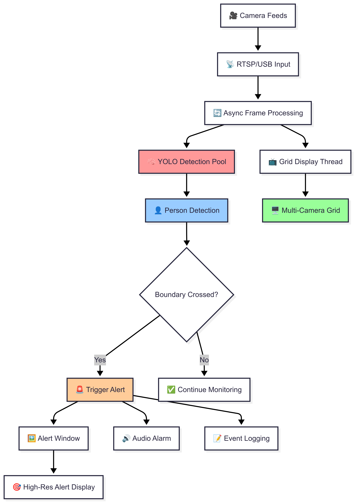

  
# Multi camera intruder detection with alerts #

**A high-performance, multi-camera security monitoring system with real-time AI-powered person detection, boundary crossing alerts, and optimized streaming architecture**

🎯 **Key Features**
<table><tr><td width="50%">
🔥 Core Capabilities

- ✅ Multi-Camera Support - Monitor 16+ cameras simultaneously
- ✅ AI Person Detection - YOLOv8 with GPU acceleration
- ✅ Interactive Boundaries - Mouse-drawable security zones
- ✅ Real-Time Alerts - Instant popup notifications
- ✅ RTSP & USB Support - IP cameras and local devices
- ✅ Smart Grid Layout - Automatic camera arrangement
</td><td width="50%">
  
⚡ **Advanced Features**

- 🚀 Async Processing - Non-blocking AI inference
- 🎯 Auto Window Management - Smart alert focusing
- 🔊 Audio Alarms - Customizable sound alerts
- 📈 Performance Monitoring - Real-time statistics
- 🔄 Auto Reconnection - Handles dropped connections
- 💾 Memory Efficient - Smart caching system
</td></tr></table>

System Architecture Comparison
<table>
<tr>
<th>📊 Metric</th>
<th>🔴 Before (Synchronous)</th>
<th>🟢 After (Asynchronous)</th>
<th>📈 Improvement</th>
</tr>
<tr>
<td><strong>YOLO Calls/Second</strong></td>
<td>360 (12 cams × 30 FPS)</td>
<td>60 (12 cams × 5 FPS)</td>
<td><code>6x Reduction</code></td>
</tr>
<tr>
<td><strong>Stream Lag</strong></td>
<td>500-2000ms delay</td>
<td><50ms delay</td>
<td><code>20x Faster</code></td>
</tr>
<tr>
<td><strong>CPU Usage</strong></td>
<td>85-95% (bottleneck)</td>
<td>30-45% (optimal)</td>
<td><code>50% Reduction</code></td>
</tr>
<tr>
<td><strong>Memory Usage</strong></td>
<td>4-6GB (leaks)</td>
<td>2-3GB (stable)</td>
<td><code>50% Reduction</code></td>
</tr>
<tr>
<td><strong>Alert Response</strong></td>
<td>1-3 seconds</td>
<td><500ms</td>
<td><code>6x Faster</code></td>
</tr>
</table>
